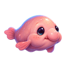

# Blobby

A tiny iPhone habitat game about guiding a laid-back blobfish through the deep sea.

Built with **Swift + SpriteKit** for gameplay and **SwiftUI** for the app interface. This is a playable V1 prototype: gently guide Blobby toward snacks, hide in a coral crevice when predators approach, and try to keep all three hearts.

## Requirements

- A Mac with Xcode 26 or newer and an installed iOS simulator runtime. The current project has been verified with Xcode 26.6 / iOS 26.5.
- Deployment target: iOS 17 or newer. Liquid Glass is used on iOS 26+, with system-material fallbacks on earlier versions.
- No third-party packages, backend, or API keys.

## Open and run

1. Open `Blobby.xcodeproj` in Xcode.
2. Choose the **Blobby** scheme and any iPhone simulator.
3. Press Run (⌘R).

All art and audio assets are bundled in the project. Once Xcode and its simulator runtime are installed, no additional downloads or accounts are required for simulator play.

For a physical iPhone, select your own team under **Signing & Capabilities**, choose a unique bundle identifier if needed, connect your device, and select it as the run destination. Device installation requires Apple development signing; certificates and private keys are not included in this repository.

## V1 controls and loop

- Drag anywhere to guide Blobby with gentle, floaty motion.
- Intercept drifting shrimp, follow crabs across the seafloor, or visit slow-moving urchins and shellfish. They all restore the same amount of contentment.
- When the big-fish warning appears, guide Blobby into the dark crevice inside the coral-and-sponge outcrop on the left.
- Eating and successfully hiding raise contentment. A missed hide costs one of three lives.
- Eat 50 snacks while below three hearts to recover one life. Progress carries across missed hides; snacks at full health do not bank extra hearts.
- When all hearts are gone, Restart resets the habitat and session counters.
- Game Over shows snacks eaten, predators avoided, and saved bests for each.
- Touching the coral outcrop guides Blobby into its crevice. “Safe and snug” confirms protection immediately.
- Bottom creatures spawn with space between them, and stop behind other creatures.
- The first predator comes after 22–28 seconds of active play. Visits gradually become more frequent over four minutes, with warning time adjusted for the trip to shelter.
- Game Over presents a front-facing sad Blobby with his classic droopy blobfish frown.
- A first-play tutorial explains drifting, eating, hiding, and puffing. It shows once; reopen it from Settings → How to play.
- Shake the phone hard three times, or tap Puff, to double Blobby’s size for a few seconds. Settings can show on-screen move, shelter, snack, and puff controls. VoiceOver and Switch Control turn those controls on automatically.
- A distant sperm whale or submarine silhouette occasionally drifts behind the habitat; it is purely decorative and never affects gameplay. Calm motion pauses these spawns.
- Underwater ambience and distinct eating, predator-warning, and close-call sounds provide feedback.
- Eating, reaching safety, losing a life, and restarting use subtle haptics on a physical iPhone.
- Eating also gives Blobby a small floating “nom nom” reaction.
- A missed predator hide makes Blobby exclaim “Yowza!” as a life is lost.
- Losing the final heart gives a distinct system error haptic, once per Game Over. The Haptics setting also controls this feedback; physical iPhone testing is needed to feel it.
- Settings, tutorial, Game Over, and app interruptions pause gameplay. Returning does not fast-forward predators or hunger. Audio stops while the app is inactive.
- Restart clears leftover meal bubbles and reaction text as well as session state.

## Interface and accessibility

- On iOS 26, native Liquid Glass is reserved for the floating status, settings, tutorial, and restart controls; the habitat remains an unobstructed content layer.
- Earlier supported iOS versions use system materials as a fallback.
- Controls use semantic SwiftUI text, SF Symbols, VoiceOver labels, and comfortable touch targets.
- Status messages pair words with symbols rather than relying on color alone.
- Sound, haptics, Calm Motion, and assistive controls can be adjusted from the in-game Settings sheet.
- The status panel stacks its hearts when horizontal space is tight. Tutorial and results cards keep Let’s blob and Restart on screen while the rest of the card scrolls, including at large accessibility text sizes.
- Custom Liquid Glass falls back to solid fills when Reduce Transparency or Increase Contrast is on. Reduce Motion turns Calm Motion on.
- The app icon includes light, dark, and tinted Home Screen variants.

## Readiness checks (Debug only)

Set `BLOBBY_VERIFY=1` in the Xcode scheme's Run environment to exercise the actual scene transitions. The console prints `BLOBBY_GAMEPLAY_CHECKS_PASSED` on success. Checks cover snack 49/50, the three-heart cap, snack progress across missed hides, pause/resume, shelter, Game Over, haptic gating, Restart cleanup, hunger labels, and floor-food spacing.

Verification uses a separate `com.example.Blobby.readiness` preferences suite, preserving player settings and records. Relaunch with `BLOBBY_VERIFY_PERSISTENCE=1` as well to check saved preferences and records from the previous verification run; expect `BLOBBY_PERSISTENCE_CHECKS_PASSED`.

For visual checks, also set `BLOBBY_COMPACT_CHECK=1` (a 320×568-point viewport) and optionally `BLOBBY_LARGE_TEXT_CHECK=1`. With verification enabled, `BLOBBY_UI_STATE` can be `hungry`, `peckish`, `delighted`, or `tutorial` to hold the scene still. For results, use `BLOBBY_UI_STATE=results` and `BLOBBY_RESULTS_PREVIEW=1`.

Remove these environment variables to resume normal gameplay. They have no effect in Release builds. A force-quit starts a new run; only preferences, tutorial completion, and best scores persist.

Readiness pass (September 19, 2026): Debug simulator build passed on iOS 26.5 and `BLOBBY_GAMEPLAY_CHECKS_PASSED`. Tutorial and Game Over keep their primary buttons visible while the card scrolls. Launch no longer simulates a full minute of marine snow or decodes the background on the first frame. Real-device haptic feel still needs a physical check; older-iOS runtime testing remains outstanding.

## Illustrated art pass

- Blobby now uses four illustrated expressions: neutral, chewing, frightened, and hiding.
- Shrimp, crab, urchin, and shellfish use recognizable painted sprites while retaining their different movement patterns.
- Predator visits randomly select a toothfish, glowing-lure anglerfish, or sixgill shark. Each has a distinct silhouette, warning, size, and swimming pace.
- A full-height painted deep-ocean background adds depth while leaving the play area readable.
- The coral, sponge, and rock outcrop is an illustrated shelter with a clearly visible crevice.
- A custom Blobby app icon is included, with dark and tinted variants for the OS 26 Home Screen.

The illustrations are bundled prototype art and remain easy to replace in `Assets.xcassets` later.

## Project layout

- `Blobby/App`: SwiftUI app shell and SpriteKit host view.
- `Blobby/Game/GameScene.swift`: update loop, spawning, controls, game states, and HUD.
- `Blobby/Game/BlobbyNode.swift`: Blobby's illustrated expressions and reactions.
- `Blobby/Game/HabitatNodes.swift`: illustrated food, marine snow, shelter, and predator.
- `Blobby/Resources/Assets.xcassets`: character, creature, habitat, background, and app-icon artwork.

## Good next steps

- Test on a physical iPhone and tune movement speed by feel.
- Add two- or three-frame fin and tail animations.
- Save contentment and habitat unlocks with `AppStorage`.
- Prepare an App Store/TestFlight build with final signing and metadata.
